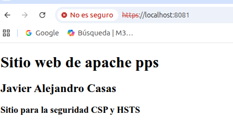
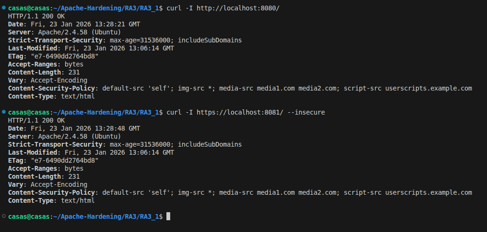

# Content Security Policy (CSP)
## Objetivo
El objetivo de esta actividad ha sido configurar Content Security Policy (CSP) en un servidor web Apache para reducir la superficie de ataque del lado del cliente. De esta manera se controla que contenido puede cargar y ejecutar el navegador.

Las configuraciones realizadas establecen lo siguiente:
- Los recursos pueden ser cargados únicamente desde el mismo dominio.
- Se bloquea la carga de imágenes, scripts y hojas de estilo desde fuentes no confiables.
- La ejecución de scripts de terceros está bloqueada.
- Permitir la navegación segura con HTTPS mediante certificados autofirmados.

## Configuraciones
En nuestro directorio de trabajo se encuentran los principales ficheros utilizados para el desarrollo de la práctica.
1. Dockerfile
2. apache2.conf: Fichero de configuración de Apache
3. index.html: Sitio web creado para la práctica


### Dockerfile
A continuación se muestra una de las principales configuraciones definidas en el fichero Dockerfile.

**Certificados**:

Para generar el par de claves pública y privada, permitiéndonos navegar de manera segura mediante el protocolo HTTPS, se ha utilizado el siguiente comando:
```bash
    RUN openssl req -x509 -nodes -days 365 -newkey rsa:2048 \
    -keyout /etc/apache2/ssl/apache-privada.key \
    -out /etc/apache2/ssl/apache-publica.crt \
    -subj "/C=ES/ST=Castellon/L=Castellon de la Plana/O=Ciberseguridad/OU=Sistema/CN=localhost"
```

**Habilitar módulos**

Es crucial habilitar los módulos dinámicos **headers** y **ssl**, permitiendo habilitar cabeceras de seguridad y el protocolo HTTPS.

```bash
RUN a2enmod headers ssl
```


### Fichero de configuración (apache2.conf)
En el fichero de configuración de Apache es donde se han aplicado la mayoría de las configuraciones de seguridad.

**Deshabilitar directorios**

Se ha deshabilitado el listado de directorios, evitando que Apache muestre los archivos y carpetas cuando no existe un fichero index.
```bash
    <Directory /var/www/html>
        Options -Indexes
        AllowOverride All
        Require all granted
    </Directory>
```
**Seguridad de cabeceras**

Con esta configuración se fuerza el uso de HTTPS mediante HSTS y se aplica la política CSP, limitando los orígenes desde los que el navegador puede cargar y ejecutar contenidos.
``` bash
    Header always set Strict-Transport-Security "max-age=31536000; includeSubDomains"
    Header set Content-Security-Policy "default-src 'self'; img-src *; media-src media1.com media2.com; script-src userscripts.example.com"
```
**Conexión segura**
Las siguientes líneas activan el motor seguro SSL de Apache y especifican la ubicación del certificado público y la clave privada del servidor.
``` bash
    SLEngine on
    SSLCertificateFile /etc/apache2/ssl/apache-publica.crt
    SSLCertificateKeyFile /etc/apache2/ssl/apache-privada.key
``` 

## Ejecución y pruebas
1) La imagen creada para el desarrollo de esta actividad, se descarga desde Docker Hub mediante el siguiente comando:
```bash
    docker pull pps13228313/pps:pr1
```

2) Después de tener descargada la imagen en el repositorio local, se crea el contenedor **apache-server**. 
> En la imagen se muestra que se crea el contenedor desde la imagen **pr1**, en vuestro caso la imagen sería **pps13228313/pps:pr1**.


3) Para comprobar las configuraciones de hardening aplicadas, se han realizado varias comprobaciones. 

3.1) Se ha comprobado que se puede acceder a nuestro sitio web desde el navegador. Se ha verificado el acceso por HTTPS a nuestro sitio web y también se puede apreciar el mensaje **No es seguro** ya que se está haciendo uso de un certificado autofirmado y no es emitido por una CA confiable.



3.2) En la siguiente imagen se muestran los comandos utilizados para comprobar que el servidor está sirviendo contenido por HTTPS y las políticas de seguridad **CSP** y **HSTS** correctamente configuradas y visibles en las cabeceras HTTP.
```bash
    Comandos:
    curl -I http://localhost:8080/

    curl -I https://localhost:8081/ --insecure
```

```bash
    Content-Security-Policy (CSP): Limita los orígenes de carga de contenido.

    Strict-Transport-Security (HSTS): Fuerza el uso de HTTPS
```
