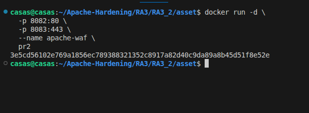
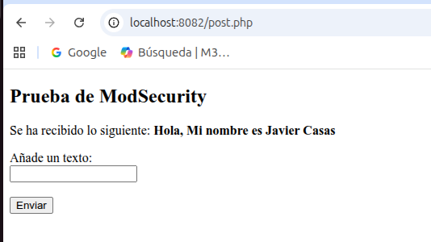
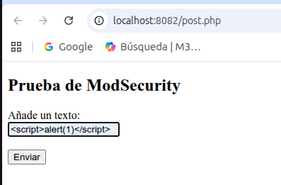
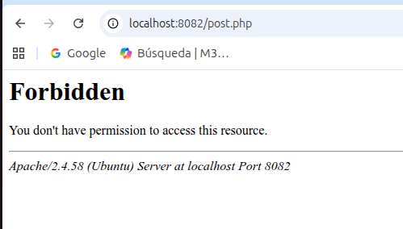

# Web Application Firewall (WAF)

## Objetivo
El objetivo de esta actividad práctica es configurar un Web Application Firewall (WAF) en Apache mediante el módulo mod_security, aplicando reglas basadas en OWASP para detectar y bloquear ataques web comunes, y desplegar la solución en una imagen Docker creada en cascada a partir de la imagen pr1 correspondiente a la práctica de CSP.

Las configuraciones realizadas establecen lo siguiente:
- Configurar la instalación de Apache para que se atenga a las reglas de mod_security, permitiendo filtrar el tráfico HTTP en tiempo real.
- Bloquear de manera activa peticiones maliciosas.

## Configuración
En el directorio actual de trabajo se han configurado los siguientes tres ficheros:
1. Dockerfile
2. modsecurity.conf
3. post.php

### Dockerfile
Las principales configuraciones definidas en el fichero Dockerfile han sido las siguientes:
1. Instalar el módulo PHP y Modsecurity, con el conjunto de reglas OWASP (CRS), permitiendo ejecutar aplicaciones PHP y protegerlas mediante un WAF.
```bash
    RUN apt update && apt install -y \
    php \
    libapache2-mod-php \
    libapache2-mod-security2 \
    modsecurity-crs
```

2. Con el siguiente código se copia la configuración recomendada de ModSecurity y se activa el motor de reglas, pasando de modo detección a bloqueo activo de peticiones maliciosas.
```bash
    RUN cp /etc/modsecurity/modsecurity.conf-recommended /etc/modsecurity/modsecurity.conf && \
    sed -i 's/SecRuleEngine DetectionOnly/SecRuleEngine On/' /etc/modsecurity/modsecurity.conf
```

### modsecurity.conf
El contenido del fichero **modsecurity.conf** habilita completamente el WAF mediante ModSecurity, activando el motor de reglas en modo preventivo. También se define una regla personalizada que identifica intentos de inyección de código, como ataques XSS, y bloquea automáticamente la solicitud devolviendo un código de estado 403, evitando que el ataque llegue a la aplicación.
```bash
    SecRuleEngine On
SecRequestBodyAccess On
SecResponseBodyAccess On
SecRule ARGS "alert\(" "deny,status:403,id:1000,msg:'Se ha identificado un intento de ataque'" 
```

### post.php
El fichero post.php ha sido utilizado como página de prueba para comprobar el funcionamiento del WAF. Permite enviar datos mediante un formulario POST y comprobar que ModSecurity inspecciona las peticiones, bloqueando aquellas que contienen patrones maliciosos.
```bash
    <!DOCTYPE html>
<html>
	<head>
    		<title>Comprobar WAF</title>
	</head>
	<body>

		<h2>Prueba de ModSecurity</h2>

		<?php
		if ($_SERVER["REQUEST_METHOD"] === "POST") {
    			$data = $_POST["data"] ?? '';
    			echo "<p>Se ha recibido lo siguiente: <strong>$data</strong></p>";
		}
		?>

		<form method="post">
    			<label>Añade un texto:</label><br>
    			<input type="text" name="data" required>
    			<br><br>
    			<button type="submit">Enviar</button>
		</form>

	</body>
</html>
```

## Ejecución y pruebas
1) La imagen creada para esta actividad recibe el nombre: **pr2** y se puede descargar desde Docker Hub mediante el siguiente comando.
``` bash
    docker pull pps13228313/pps:pr2
```
2) Una vez descargada la imagen, se crea el contenedor apache-waf.
> En vuestro caso la imagen recibe el nombre: **pps13228313/pps:pr2**



3) Para comprobar el correcto funcionamiento del firewall de aplicaciones web **WAF**, se ha realizado una serie de comprobaciones.

3.1) En la siguiente imagen se envía texto legítimo, donde la petición POST se procesa correctamente y el servidor responde sin bloquearla. Para ello nos dirigimos al navegador e ingresamos la siguiente ruta.
```bash
    localhost:8082/post.php
```



3.2) En las siguientes imágenes se muestra que al introducir código malicioso, Modsecurity detecta el patrón de ataque definido en sus reglas y lo bloquea.

El servidor devuelve el error 403 Forbidden, permitiendo comprobar que el WAF está activo.





