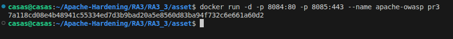
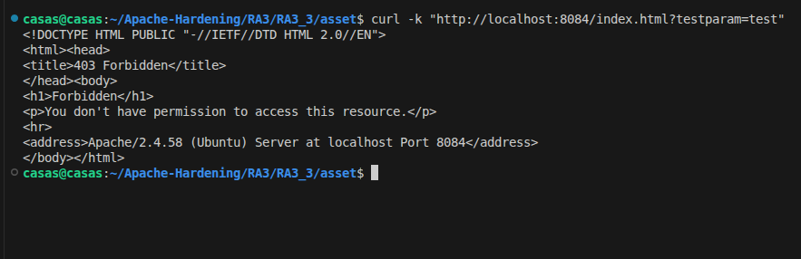
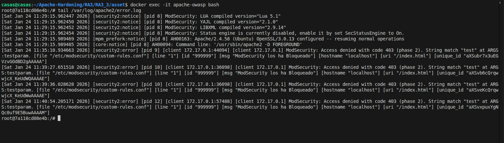

# Instalar reglas OWASP
## Objetivo 
El objetivo de esta actividad práctica es aumentar la seguridad del servidor Apache con el cual se ha trabajado hasta el momento. Teniendo esto en cuenta se ha instalado y configurado ModSecurity con las reglas OWASP CRS en Apache para proteger el servidor frente a ataques web comunes.

## Configuración
En este directorio de trabajo se encuentran los ficheros de configuración con los que se ha trabajado.
1. Dockerfile
2. security2.conf

### Dockerfile
El Dockerfile define como construir una imagen Docker. Como se ha ido trabajando con una imagen base Ubuntu con un servidor web Apache instalado, las principales configuraciones en nuestro Dockerfile son las siguientes.

1. Ese bloque del Dockerfile elimina las reglas y archivos de ModSecurity CRS que vienen por defecto en la imagen base, para evitar conflictos y dejar el entorno limpio antes de copiar o instalar nuestras reglas OWASP.
``` bash
RUN rm -rf /usr/share/modsecurity-crs \
	/usr/share/modsecurity-crs/rules \
	/usr/share/modsecurity-crs/utils
```

2. Este bloque del Dockerfile clona el repositorio oficial de OWASP ModSecurity CRS desde GitHub, copia el archivo de configuración base (crs-setup.conf) al directorio de ModSecurity y crea el directorio de reglas para instalar en él los archivos .conf, dejando así configuradas y listas las reglas OWASP.
``` bash
    RUN git clone https://github.com/SpiderLabs/owasp-modsecurity-crs.git /tmp/owasp-crs && \
    mv /tmp/owasp-crs/crs-setup.conf.example /etc/modsecurity/crs-setup.conf && \
    mkdir -p /etc/modsecurity/rules && cp /tmp/owasp-crs/rules/*.conf /etc/modsecurity/rules/
```

3. Este bloque del Dockerfile crea un archivo de reglas personalizado de ModSecurity (custom-rules.conf) que define una regla propia: si una petición HTTP contiene el parámetro testparam con el valor test, la solicitud se bloquea automáticamente, devolviendo un error 403 y registrando el evento en los logs con el mensaje indicado.
```bash
    RUN cat <<'EOF' > /etc/modsecurity/custom-rules.conf
SecRule ARGS:testparam "@contains test" "id:999999,deny,status:403,msg:'ModSecurity los ha Bloqueado'"
EOF
```

### security2.conf
El fichero security2.conf se ha creado para habilitar y configurar Modsecurity en Apache, definir el fichero donde se guardan los datos persistentes y activa el motor de reglas para que bloquee las peticiones maliciosas.
```bash
    <IfModule security2_module>
    # Directorio donde ModSecurity guarda los datos persistentes
    SecDataDir /var/cache/modsecurity

    # Hace que ModSecurity bloquee las solicitudes que coinciden con las reglas
    SecRuleEngine On

    # Se incluyen todos los archivos de configuración adicional
    IncludeOptional /etc/modsecurity/*.conf

    # Se incluyen las configuraciones de las reglas owasp
    Include /etc/modsecurity/crs-setup.conf
    Include /etc/modsecurity/rules/*.conf
</IfModule>
```

## Ejecución y pruebas
1) Para descargar la imagen de esta actividad: **pr3**, es necesario descargarla desde Docker Hub mediante el siguiente comando.
```bash
    docker pull pps13228313/pps:pr3
```

2) Para crear el contenedor **apache-owasp** se debe utilizar el siguiente comando.
> En vuestro caso la imagen sería pps13228313/pps:pr3



3) Ese comando envía una petición HTTP al servidor Apache con un parámetro sospechoso (testparam=test) usando curl y sirve para comprobar que ModSecurity y las reglas OWASP están funcionando, ya que la respuesta 403 Forbidden confirma que la petición ha sido detectada y bloqueada por una regla de seguridad.



Los siguientes logs muestran que Modsecurity está funcionando correctamente y bloqueando peticiones maliciosas. Los logs muestran que una solicitud al recurso /index.html fue denegada con código 403 porque el parámetro testparam contenía el valor test, lo que hizo que la regla personalizada con ID 999999 definida en custom-rules.conf se activara. También se muestra como indica en el banner del logs nuestro mensaje personalizado: **ModSecurity lo ha Bloqueado**



