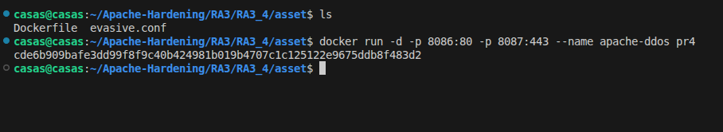
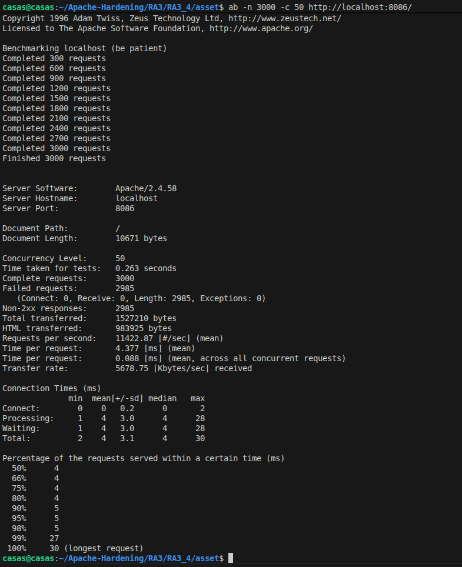
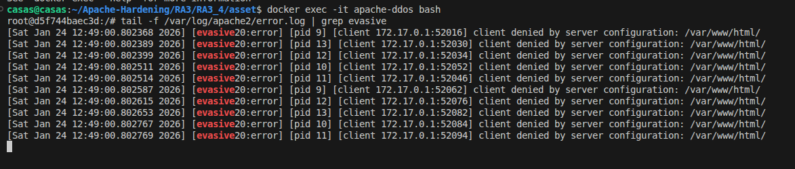

# Evitar ataques DDoS

## Objetivo
El objetivo de esta actividad es instalar y configurar el módulo mod_evasive en Apache para prevenir ataques de denegación de servicio (DoS), comprobar su funcionamiento mediante Apache Bench y crear una imagen Docker que deje esta protección instalada, configurada y verificable.

## Configuración
Para crear una imagen en Docker que permita la protección del servidor Apache ante ataques de denegación de servicio, se han utilizado dos ficheros de configuración.

1. Dockerfile
2. evasive.conf

### Dockerfile
Nuestro Dockerfile utiliza como imagen base una imagen que ya tiene configurado Apache y reglas como OWASP y Modsecurity. En este caso se añade una nueva capa de seguridad con el módulo mod_evasive.

Las principales configuraciones en nuestro fichero Dockerfile son las siguientes:
1. El siguiente bloque del Dockerfile actualiza la lista de paquetes del sistema e instala el módulo **mod_evasive** para Apache.
```bash
RUN apt update && apt install -y \
    libapache2-mod-evasive \
    iptables \
    git \
    && apt-get clean
```

2. Ese bloque del Dockerfile crea el directorio donde mod_evasive guardará sus logs y cambia sus propietarios al usuario y grupo www-data, que es el usuario con el que se ejecuta Apache.
```bash
    RUN mkdir -p /var/log/mod_evasive && \
    chown -R www-data:www-data /var/log/mod_evasive
```

### evasive.conf
El fichero evasive.conf sirve para configurar el módulo mod_evasive en Apache con el fin de evitar ataques de denegación de servicio (DoS). En él se establecen límites sobre el número de peticiones que una misma IP puede realizar a una página concreta y al sitio web en un corto periodo de tiempo. Si esos límites se superan, la IP se bloquea temporalmente, se registra el intento en los logs y se puede enviar una notificación por correo.
```bash
    <IfModule mod_evasive20.c>
    # Tamaño de la hash interna
    DOSHashTableSize 3097
    
    # Número máximo de peticiones a la misma URL permitida
    DOSPageCount 2

    # Número total de peticiones al sitio web
    DOSSiteCount 10

    # Contar las peticiones a la misma página
    DOSPageInterval 1
    DOSSiteInterval 1

    # Tiempo en segundo que una IP permanece bloqueada
    DOSBlockingPeriod 10

    # Email de alertas 
    DOSEmailNotify  root@localhost

    # Directorio donde mod_evasive guarda sus logs
    DOSLogDir "/var/log/mod_evasive"
</IfModule>
```

## Ejecución y pruebas
1. Para descargar esta imagen desde Docker Hub a vuestro repositorio local, se debe utilizar el siguiente comando:
```bash
    docker pull pps13228313/pps:pr4
``` 
2. En la siguiente imagen se muestra el comando utilizado para crear el contenedor **apache-ddos**. 
> En vuestro caso el nombre de la imagen sería **pps13228313/pps:pr4** en lugar de **pr4**.



3. A continuación, se muestran las comprobaciones realizadas para verificar que el módulo mod_evasive está funcionando, protegiendo el servidor Apache de ataques de denegación de servicio.

3.1) Con el siguiente comando se ha simulado una carga intensa de tráfico contra el servidor web y se comprueba como responde Apache cuando recibe muchas peticiones simultáneas.

Primero que nada es crucial instalar las utilidades de apache en vuestro equipo local, ya que esto permite utilizar Apache Bench (ab)
```bash
    sudo apt install apache2-utils
```

Como para realizar la comprobación:
```bash
    ab -n 3000 -c 50 http://localhost:8086/
```

Concretamente, ab -n 3000 -c 50 http://localhost:8086/ envía 3000 peticiones HTTP en total (-n 3000) con un nivel de 50 conexiones concurrentes (-c 50) al servidor.



3.2) El siguiente comando entra en el contenedor Docker y consulta los logs de error de Apache filtrando los eventos de mod_evasive, para comprobar si el módulo está bloqueando peticiones.

Lo que se observa en la salida indica que las peticiones procedentes de la IP 172.17.0.1 están siendo denegadas, lo que confirma que mod_evasive ha detectado un comportamiento abusivo, bloqueando las conexiones correctamente.

**Comando para acceder al contenedor**:
```bash
    docker exec -it apache-ddos bash
```
**Comando para visualizar los logs**:
```bash
    tail -f /var/log/apache2/error.log | grep evasive
```



