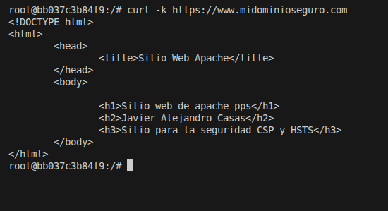
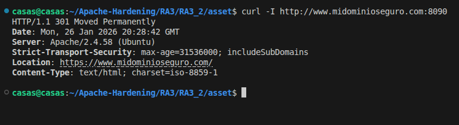

# Certificados

## Objetivo
El objetivo de esta práctica es instalar y configurar un nuevo certificado digital SSL/TLS en Apache para cifrar las comunicaciones entre el cliente y el servidor. De esta manera, se puede verificar el funcionamiento de HTTPS mediante un certificado autofirmado, comprender sus limitaciones frente a certificados emitidos por una autoridad de confianza, y configurar la redirección automática de HTTP a HTTPS.

## Configuración
En este directorio se encuentran los principales ficheros de configuración utilizados y modificados, permitiéndonos crear el certificado digital autofirmado.

Los ficheros de configuración utilizados son los siguientes:
1. Dockerfile
2. apache2.conf
3. hosts

### Dockerfile
Al igual que en actividades anteriores, **Dockerfile** es el fichero que define de manera automática como crear una imagen en Docker.

1. La principal configuración en nuestro fichero Dockerfile ha sido crear un nuevo certificado SSL autofirmado junto a su par de claves (pública y privada). Los datos de identidad del certificado han sido los mismos que el certificado creado en la actividad **3.1.1**. Sin embargo, cambia el nombre del dominio para el que es válido este certificado, en este caso es:
> CN=www.midominioseguro.com

```bash
    RUN openssl req -x509 -nodes -days 365 \
    -newkey rsa:2048 -keyout /etc/apache2/ssl/apache.key -out /etc/apache2/ssl/apache.crt \
    -subj "/C=ES/ST=Castellon/L=Castellon de la Plana/O=Ciberseguridad/OU=Sistemas/CN=www.midominioseguro.com"
```

2. La seguridad del directorio del sitio web es crucial, por lo que se asigna como propietario y grupo del directorio /var/www/html al usuario www-data, que es el usuario con el que se ejecuta Apache, y estableciendo permisos 775, permitiendo que Apache lea, escriba y ejecute los archivos necesarios, mientras que otros usuarios solo tienen permisos de lectura y ejecución.
```bash
    RUN chown -R www-data:www-data /var/www/html \
    && chmod -R 775 /var/www/html 
```

### apache2.conf
Este es el fichero de configuración de nuestro servidor Apache. Este ha sido el fichero utilizado hasta el momento, por lo que se le han añadido medidas de seguridad adicionales como: 

1. Redirección forzada de HTTP a HTTPS.

Todo el tráfico que entra por el puerto 80 se redirige permanentemente a HTTPS, evitando conexiones no cifradas.
```bash
    Redirect permanent / https://www.midominioseguro.com/
```

2. Cifrado de las comunicaciones SSL/TLS.

Se utiliza el certificado digital creado en el Dockerfile para cifrar las comunicaciones entre el cliente y el servidor.
```bash
    SSLEngine on
    SSLCertificateFile /etc/apache2/ssl/apache.crt
    SSLCertificateKeyFile /etc/apache2/ssl/apache.key
```


3. Deshabilitación del listado de directorios.

Evita que un usuario vea el contenido de los directorios si no existe un archivo índice.
```bash
    Options -Indexes
```

4. Protección frente a navegadores antiguos

Este bloque de configuración SSL de Apache garantiza el correcto funcionamiento de scripts dinámicos bajo HTTPS y mejora la compatibilidad con navegadores antiguos, exponiendo variables de entorno SSL a archivos CGI y PHP para que puedan acceder a información del cifrado y del certificado, y aplicando ajustes específicos a distintas versiones de Internet Explorer para evitar errores en el manejo de conexiones SSL, cierres incorrectos y problemas de compatibilidad en la comunicación segura.
```bash
    <FilesMatch "\.(cgi|shtml|phtml|php)$">
		   SSLOptions +StdEnvVars
    </FilesMatch>
    <Directory /usr/lib/cgi-bin>
                    SSLOptions +StdEnvVars
    </Directory>
    BrowserMatch "MSIE [2-6]" \
                    nokeepalive ssl-unclean-shutdown \
                    downgrade-1.0 force-response-1.0
    BrowserMatch "MSIE [17-9]" ssl-unclean-shutdown
```

## Ejecución y pruebas
1. La imagen creada en esta actividad se puede descargar desde Docker Hub mediante el siguiente comando:
```bash
    docker pull pps13228313/pps:pr6
```

2. Para crear el contenedor **certificados** se utiliza el siguiente comando. 
> En vuestro caso la imagen recibe el nombre **pps13228312/pps:pr6**

```bash
    docker run -d -p 8090:80 -p 8091:443 --name certificados pr6
```

3. A continuación, se explican dos pasos fundamentales para comprobar el funcionamiento de nuestro certificado creado correctamente.

3.1) Modificaremos el fichero de resolución local de nombres **/etc/hosts** en nuestro equipo local. Estas modificaciones las he realizado por comodidad, sin embargo, las pruebas se pueden realizar sin modificar estos ficheros. Este punto será explicado en el siguiente apartado.

Añadiremos al final del fichero la IP local de nuestro equipo y el dominio correspondiente a nuestro certificado creado previamente.
```bash
    127.0.0.1   www.midominioseguro.com
```

3.2) Después de modificar el fichero en nuestro equipo local, deberemos modificarlo en nuestro contenedor.

Accedemos al contenedor:
```bash
    docker exec -it certificados bash
``` 

Modificamos el fichero /etc/hosts igual que hicimos en nuestro equipo local:
```bash
    127.0.0.1   www.midominioseguro.com
```

3.3) Como se había mencionado anteriormente, la modificación de los ficheros /etc/hosts ha sido adicionales, ya que las pruebas de funcionamiento del certificado se pueden realizar de igual manera.

Las comprobaciones se han realizado tanto desde el contenedor **certificados** como desde nuestro host físico.

Esta comprobación realizada desde el contendor **certificados** demuestra que el servidor Apache dentro del contenedor está correctamente configurado para servir contenido HTTPS usando el dominio configurado, con un certificado SSL funcional y un VirtualHost bien definido, validando la configuración interna del servidor.

El comando utilizado ha sido el siguiente:
```bash
    curl -k https://www.midominioseguro.com
```



También se ha realizado una comprobación desde el navegador con el objetivo de acceder a nuestro sitio web de manera segura.

En la siguiente imagen se puede observar como se ha podido acceder al sitio web:


Si accedemos a detalles generales del certificado, podemos observar como nuestro certificado está correctamente asociado al dominio **www.midominioseguro.com**.


3.4) A continuación, se muestra el comando utilizado para comprobar que se fuerza la redirección de HTTP a HTTPS cuando se accede a nuestro sitio web.



