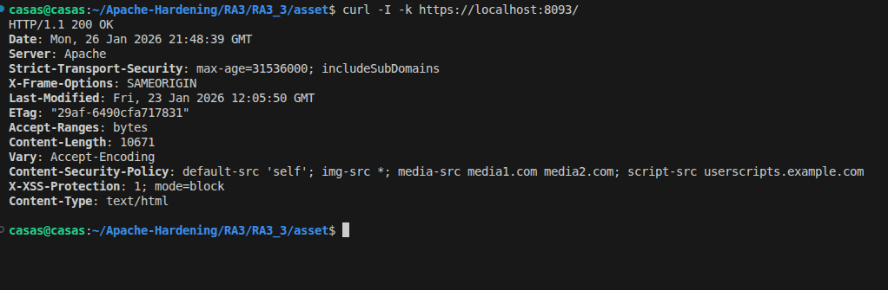
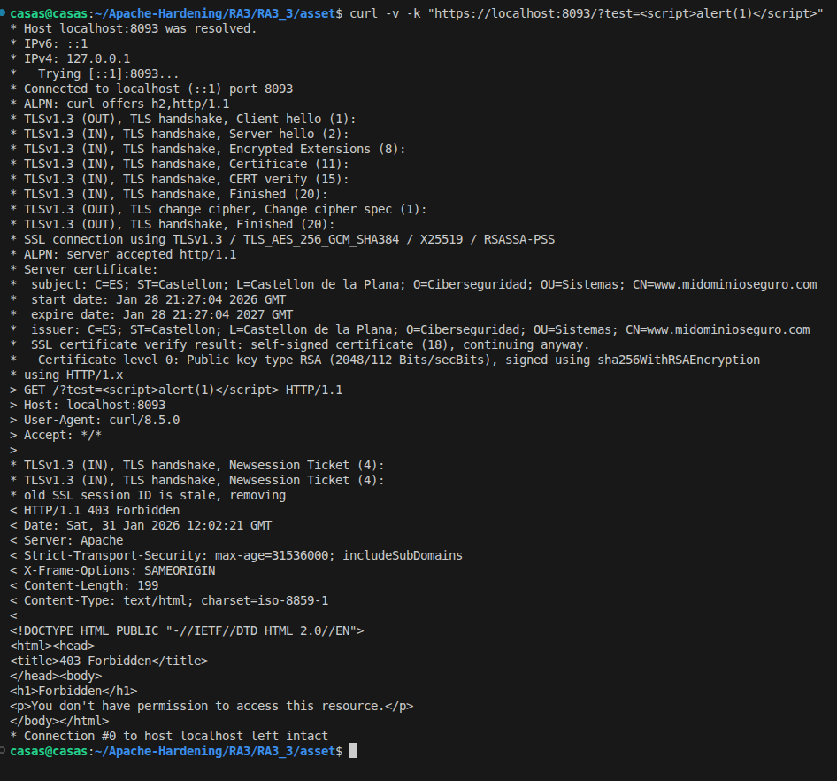
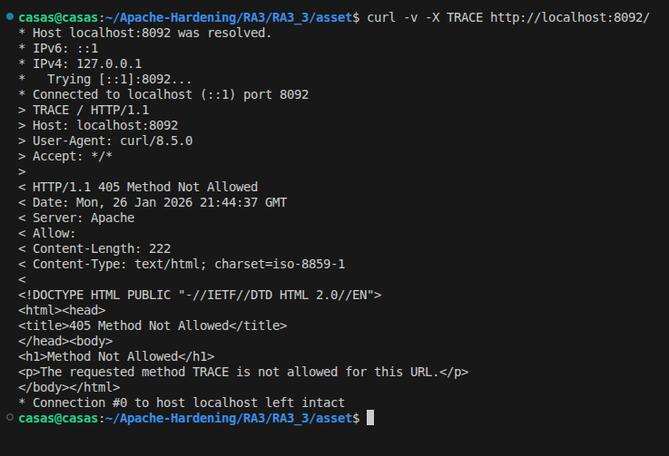

# Mejores prácticas de endurecimiento de Apache

## Objetivo
El objetivo de esta actividad es aplicar las mejores prácticas de endurecimiento del servidor Apache en el que hemos ido trabajando hasta el momento. 

Las principales configuraciones aplicadas son las siguientes:
- Cifrar las comunicaciones entre el cliente y el servidor.
- Forzar la redirección de HTTP a HTTPS.
- Impedir que los usuarios puedan cambiar la configuración.
- Eliminar la configuración predeterminada.
- Deshabilitar solicitudes HTTP.
- Verificar el correcto funcionamiento del certificado.

## Configuraciones

En esta práctica se han utilizado tres ficheros de configuración indispensables.

1. Dockerfile
2. apache2.conf
3. modsecurity.conf

### Dockerfile
Las principales configuraciones del fichero Dockerfile se muestran a continuación.

1. Con el siguiente comando se cambia el propietario y el grupo de todo el contenido del direcotio web **/var/www/html** a **www-data**. En este caso **www-data** es el usuario y grupo con el que se ejecuta apache.
```bash
    RUN chown -R www-data:www-data /var/www/html
```

2. El siguiente comando restringe los permisos del directorio de configuraciones disponibles de Apache. 

- El propietario tiene permisos: lectura, escritura y ejecución.
- El grupo tiene permisos: lectura y ejecución.
- Otros: sin ningún acceso.
```bash
    chmod -R 750 /etc/apache2/conf-available
```

### apache2.conf
Este es el fichero de configuración de Apache con el que se ha ido trabajando hasta el momento. En este punto, se le han asignado configuraciones específicas, garantizando las mejores prácticas de seguridad en Apache.

1. Estas directivas de hardening en Apache reducen la información expuesta y eliminan funcionalidades innecesarias del servidor: **ServerTokens Prod** limita las cabeceras HTTP para que Apache no muestre su versión ni detalles del sistema, **ServerSignature Off** evita que se revele información del servidor en páginas de error, y **TraceEnable Off** deshabilita el método HTTP TRACE para prevenir ataques como Cross-Site Tracing, disminuyendo así la superficie de ataque del servidor.
```bash
    ServerTokens Prod
    ServerSignature Off
    TraceEnable Off
```

2. En el siguiente código se muestra como se aplica una de las principales medidas de seguridad en el directorio **/vas/www/html**

- **-Indexes**: Deshabilita el listado de directorios.
- **AllowOverride None**: Evita que usuarios o aplicaciones modifiquen la configuración del servidor.
- **LimitExcept GET POST HEAD**: previene ataques que abusan de métodos HTTP.

```bash
    Directory /var/www/html>
        Options -Indexes -Includes
        AllowOverride None
        <LimitExcept GET POST HEAD>
            deny from all
        </LimitExcept>
    </Directory>
```

3. Este bloque de configuración aplica cabeceras de seguridad HTTP en Apache para reforzar la protección del lado cliente, forzando el uso de HTTPS mediante HSTS, restringiendo las fuentes de contenido con Content Security Policy para mitigar ataques XSS, activando mecanismos de protección frente a scripts maliciosos y clickjacking, y asegurando las cookies para que solo se transmitan por conexiones cifradas.
```bash
    Header always set Strict-Transport-Security "max-age=31536000; includeSubDomains"
    Header set Content-Security-Policy "default-src 'self'; img-src *; media-src media1.com media2.com; script-src userscripts.example.com"
    Header set X-XSS-Protection "1; mode=block"
    Header always append X-Frame-Options SAMEORIGIN
    Header edit Set-Cookie ^(.*)$ "$1; HttpOnly; Secure"
```

### modsecurity.conf
En la actividad 3.1.2 (WAF) ya se había configurado este fichero. En este punto se han añadido las siguientes líneas:

1. Reduce el ruido ya que los logs se registran únicamente las líneas relevantes definidas en la reglas: **SecRule ARGS "alert\(" "deny,status:403,id:1000,msg:'Se ha identificado un intento de ataque'"**
```bash
    SecAuditEngine RelevantOnly
```

2. Especifica el archivo de auditoría donde se guardan los eventos de seguridad detectados.
```bash
    SecAuditLog /var/log/apache2/modsec_audit.log
```


## Ejecución y pruebas
1. Para descargar la imagen creada desde Docker Hub se debe utilizar el siguiente comando:

>En vuestro caso la imagen recibe el nombre: pps13228313/pps:pr7

```bash
    docker pull pps13228313/pps:pr7
```

2. El contenedor creado recibe el nombre: **seguridad-apache**. Para crearlo se utiliza el siguiente comando.
```bash
    docker run -d -p 8092:80 -p 8093:443 --name seguridad-apache pr7
``` 

3. Después de tener el contenedor en marcha, se da comienzo a una serie de pruebas para evaluar su funcionamiento.

3.1) Este comando sirve para validar de forma rápida y limpia que Apache está bien configurado y protegido a nivel de cabeceras HTTP.

```bash
    curl -I -k https://localhost:8093/
```



3.2) El siguiente comando realiza una comprobación de seguridad para verificar si el servidor Web tiene protección contra ataques **Cross-Site-Scripting (XSS)**
```bash
    curl -v -k "https://localhost:8093/?test=<script>alert(1)</script>"
```




3.3) El siguiente comando intenta usar una función de diagnóstico potencialmente peligrosa y el servidor la rechazó con un error 405. Esto confirma que el servidor Web está protegido contra ataques de Cross-Site Tracing (XST). Además se puede observar que no muestra la versión de Apache, impidiendo que un atacante pueda trazar un plan de ataque identificando vulnerabilidades conocidas de determinadas versiones.

```bash
    curl -v -X TRACE http://localhost:8092/
```




